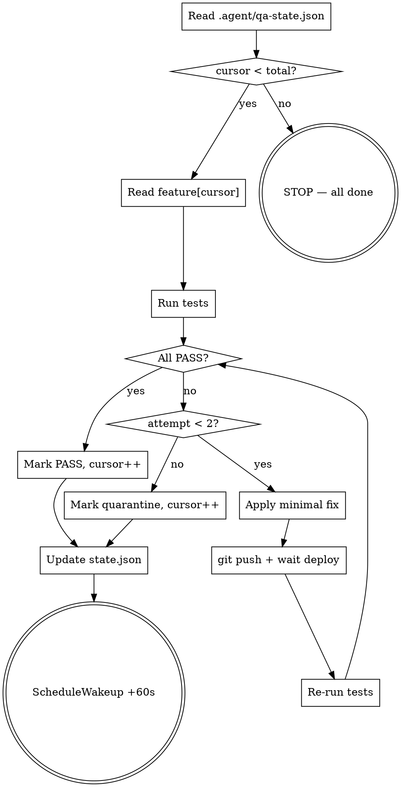

# QA-LOOP: посистемная проверка всех 73 ночных фич

> Этот файл — инструкция для команды `/loop`. Цель: проверить каждую реализованную фичу по очереди, исправить баги, обновить state.
>
> **Запуск:** `/loop docs/QA_LOOP_PLAN.md` (без интервала — динамический режим, ScheduleWakeup сам решит когда продолжить).

---

## Цель цикла

Прогнать **73 фичи + 4 баг-фикса** последовательно. На каждой итерации:
1. Взять одну фичу из очереди (по cursor).
2. Прогнать её тесты (HTTP smoke + при необходимости Playwright + БД-проверки).
3. Если **PASS** — отметить done, передвинуть cursor.
4. Если **FAIL** — минимальный безопасный fix → задеплоить → retest. Если после 2 попыток всё ещё FAIL — отметить `quarantine` с описанием проблемы, передвинуть cursor.
5. Продолжать до конца очереди или до явного STOP.

## Правила

1. **Один feature за итерацию.** Не лезть в соседние.
2. **Проверка > исправление.** Если фича работает — отмечаем PASS и идём дальше. Не «улучшаем» рабочее.
3. **Минимальный diff** при fix'е. Одна строка > большой рефакторинг. Большие правки помечать как `quarantine: needs-design` и НЕ пытаться сделать сейчас.
4. **Между деплоями — пауза.** После каждого `git push` запустить Monitor чтобы дождаться `cat .build-sha == HEAD`. Без этого следующий push коллизит.
5. **Каждый failed deploy перепроверять** — иногда `npx next build` падает на проде, нужно вручную пересобрать через SSH.
6. **Никогда не делать destructive операций** без явного человеческого OK: drop tables, force-push, DELETE массовый.

## Файлы состояния

- `.agent/qa-features.json` — массив фич с тестами и cursor=`status` per item
- `.agent/qa-state.json` — { cursor, lastRunAt, totalsPass, totalsFail, totalsQuarantine }
- `.agent/qa-results.md` — человекочитаемый log результатов (append-only)

## Поток одной итерации



## Виды тестов (что считать PASS)

### Тип `endpoint-auth`
HTTP-запрос на endpoint без auth ожидает `401`. С неправильным методом — `405`.
```
curl -sS -o /dev/null -w '%{http_code}' http://127.0.0.1:3002<path>
expected: 401 (or 405 if wrong method)
PASS если ≠ 404 и ≠ 5xx.
```

### Тип `endpoint-public`
HTTP-запрос без auth должен возвращать 200 (для публичных) или 307 (для protected).
```
expected: 200 | 307
PASS если ≠ 4xx (исключая 307) и ≠ 5xx.
```

### Тип `cron-secret`
GET без secret ожидает `401`.
```
expected: 401
```

### Тип `file-exists`
Файл должен присутствовать на проде в указанном пути.
```
ls /var/www/wesetupru/data/www/wesetup.ru/app/<path>
PASS если file size > 0.
```

### Тип `db-field`
Поле есть в schema (через Prisma).
```
echo "select column_name from information_schema.columns where table_name='Organization' and column_name='<field>';" | psql ...
PASS если 1 row returned.
```

### Тип `playwright-page`
Страница рендерится без console errors.
```
playwright.navigate(<url>)
playwright.console_messages level=error
PASS если 0 errors.
```

### Тип `manual-only`
Фича требует человеческой проверки (например, интерактивная UI feature). Помечаем `manual` и пропускаем — отдельный человеческий чек.

## Когда `/loop` останавливается

- Когда `cursor >= total` → `STOP — all done`.
- Когда пользователь явно прервал.
- Когда 5 фич подряд `quarantine` (что-то системно сломано — лучше остановиться и попросить human).
- При timeout `ScheduleWakeup` (max 1h between iterations).

## Финальный отчёт

В конце цикла создать `docs/QA_LOOP_REPORT.md` с:
- Total: PASS / FAIL / QUARANTINE / MANUAL
- Top issues (если quarantine'ы)
- Список fixed-bugs с SHA коммитов
- Time elapsed

## Не делать

- ❌ Не модифицировать чужие фичи если эта фича PASS — лезть только в проблемную.
- ❌ Не рефакторить, даже если соблазнительно. Только bug-fix минимальной диффом.
- ❌ Не пушить пакетами по 5 коммитов — каждый fix отдельным push'ем + wait deploy.
- ❌ Не запускать destructive миграции без `prisma db push` контекста.
- ❌ Не выводить в продакшн фичи которые требуют новой инфраструктуры (S3, Sentry, OAuth) — они в плане помечены `requires-infra`.

## Известные ограничения окружения

- `ANTHROPIC_API_KEY` пуст на проде → AI endpoints (translate, generate-sop, check-photo, haccp-plan, period-report, capa-suggest, weekly-ai-digest, predict-alerts) вернут **503** — это **PASS**, не FAIL. Эти эндпоинты ожидают 503 при отсутствии ключа.
- `RESEND_API_KEY` пуст → email-фичи в dev-fallback (логируют, не отправляют) — это PASS.
- `SUPPORT_TELEGRAM_CHAT_ID` пуст → support-widget пишет в AuditLog — PASS.
- `DADATA_API_KEY` пуст → /api/public/inn-lookup может вернуть 502 — это **PASS** (graceful degradation).
- Cron'ы (yandex-backup, shift-watcher, etc.) не подключены к внешнему scheduler — endpoint работает но не вызывается. Тестируем endpoint-secret-401, не реальный run.

## Команда запуска

```
/loop docs/QA_LOOP_PLAN.md
```

При желании можно ограничить интервал: `/loop docs/QA_LOOP_PLAN.md every 60s`. По умолчанию — динамический.
